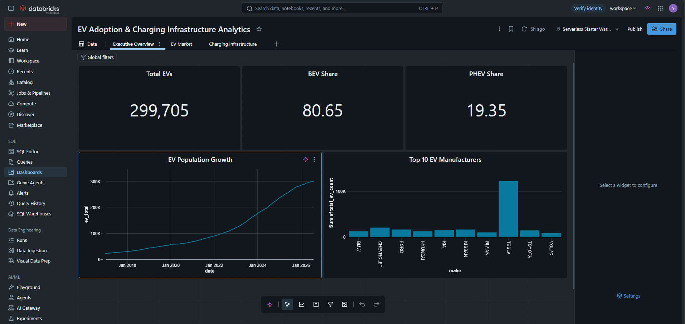
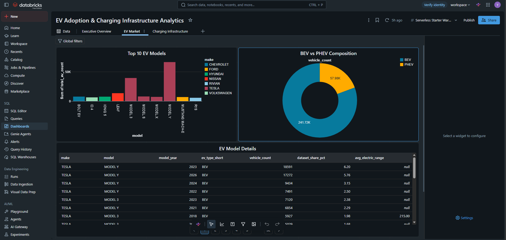
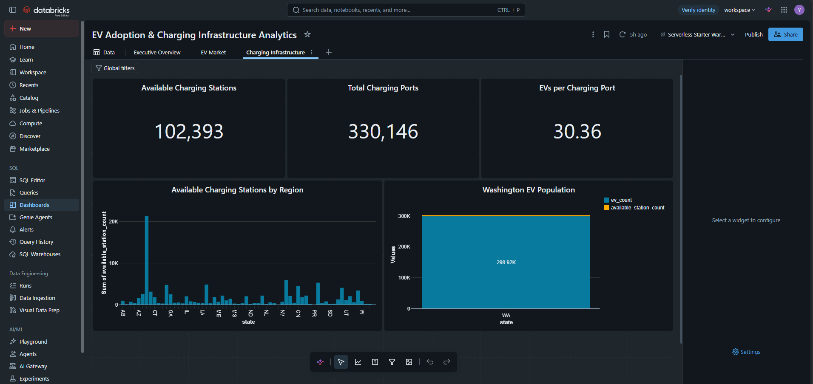

# Databricks Dashboard

The project includes an interactive Databricks dashboard built on the Gold analytical layer.

The dashboard provides three views of the EV ecosystem.

## 1. Executive Overview

Provides a high-level view of EV adoption.

**KPIs**
- Total EVs
- BEV Share
- PHEV Share

**Visualizations**
- EV Population Growth
- Top 10 EV Manufacturers

---

## 2. EV Market

Explores the composition of the registered EV population.

**Visualizations**
- Top 10 EV Models
- BEV vs PHEV Composition
- EV Model Details

---

## 3. Charging Infrastructure

Explores currently available EV charging infrastructure.

**KPIs**
- Available Charging Stations
- Total Charging Ports
- EVs per Charging Port in Washington

**Visualizations**
- Available Charging Stations by Region

---

## Data Source

Dashboard metrics are calculated from the project's Gold analytical tables rather than directly from raw source data.

This ensures that dashboard calculations use the same cleaned data and metric definitions as the SQL analysis and Databricks Genie environment.